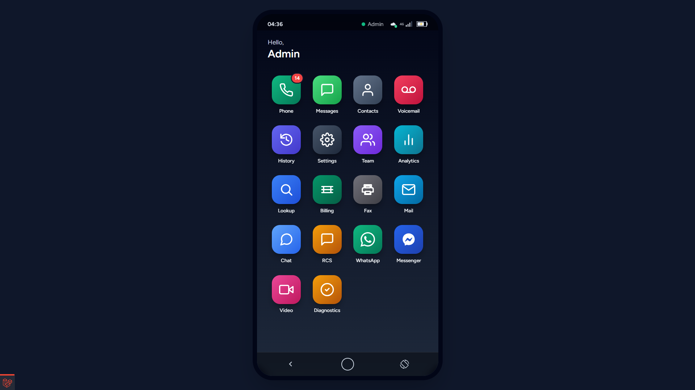
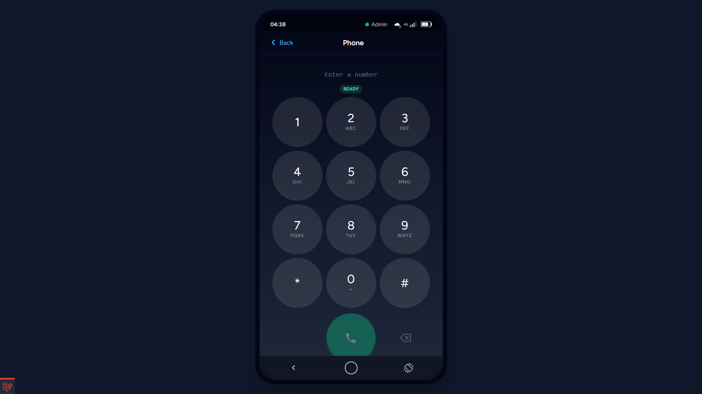
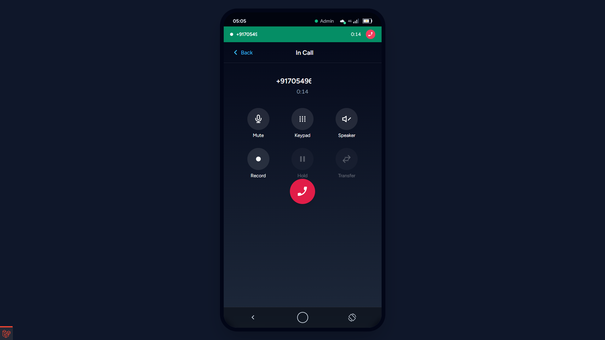
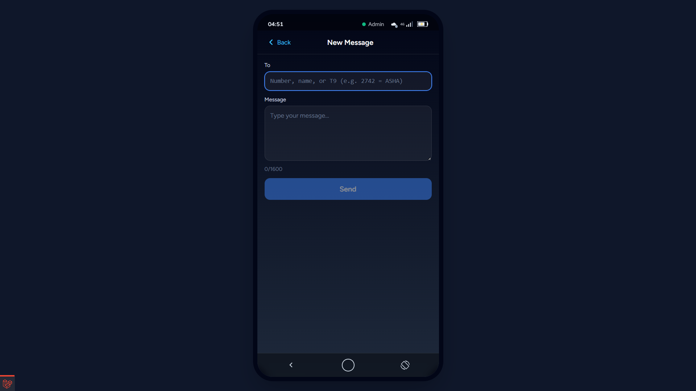
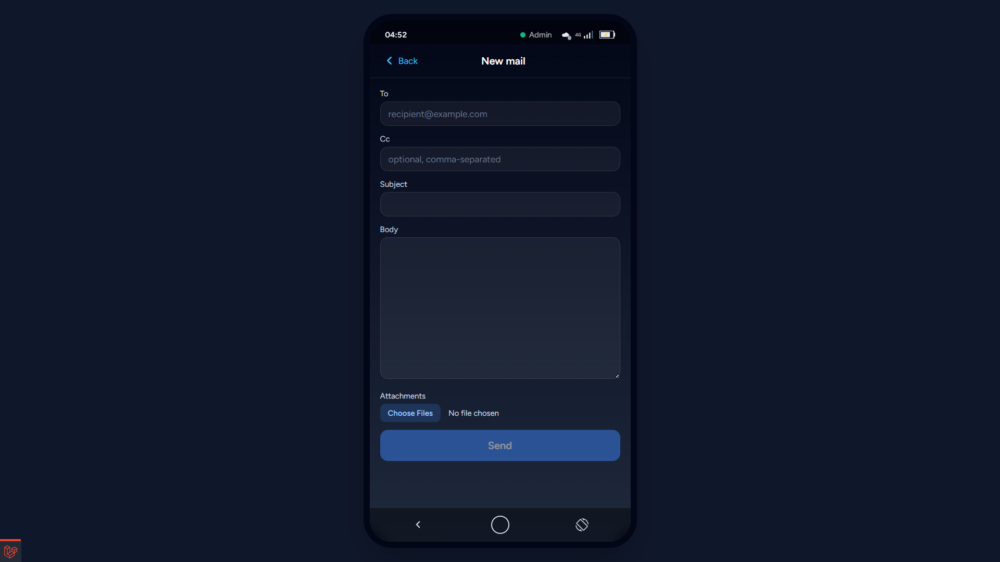
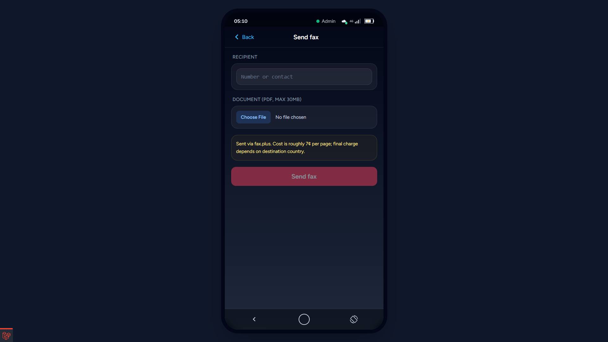
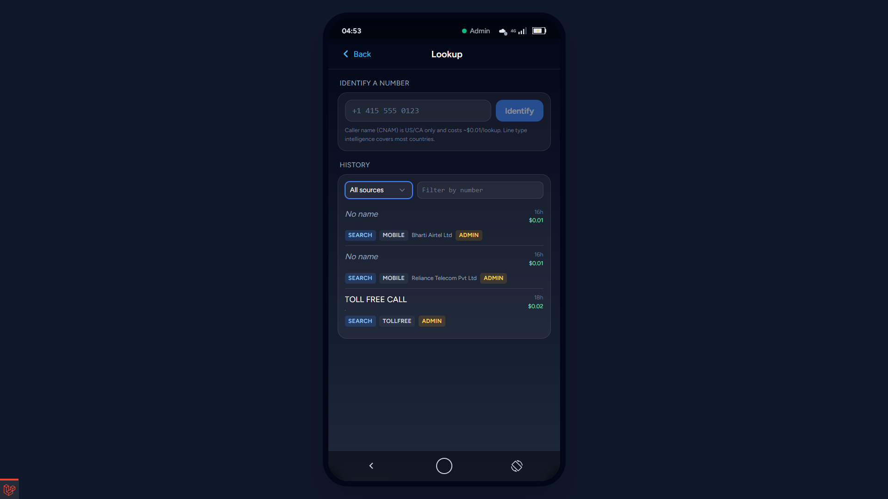
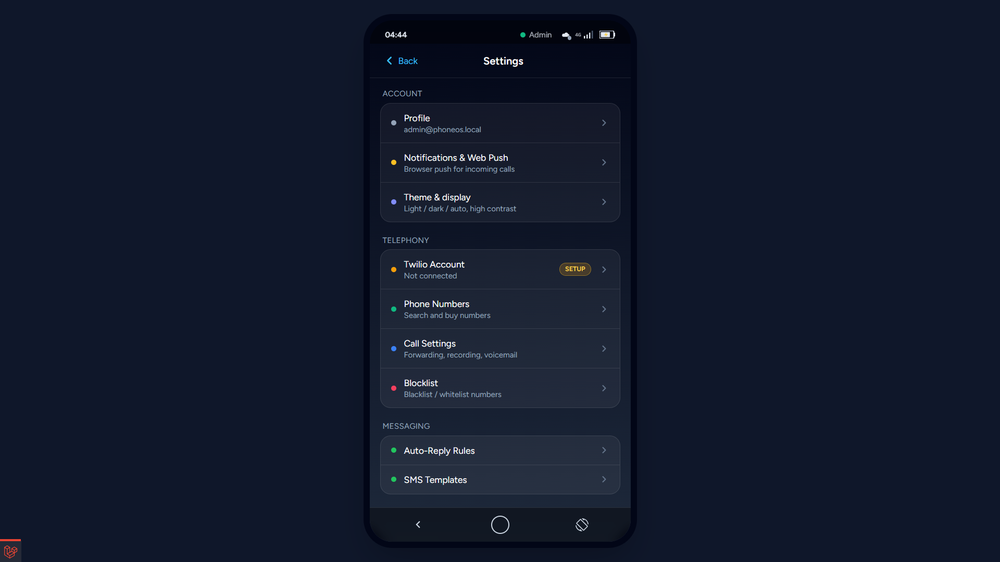
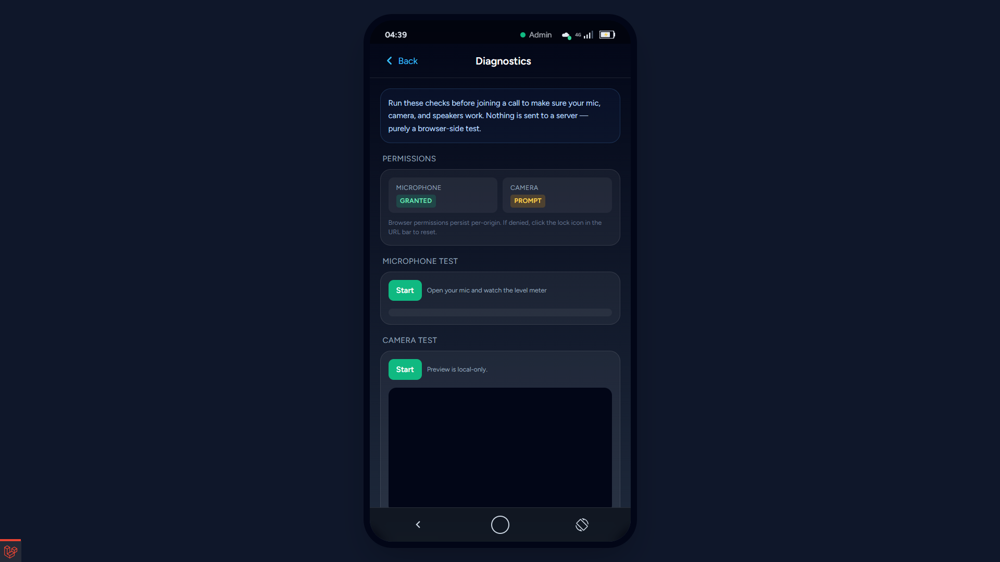

# Virtual Phone OS

A browser-based "smartphone" UI that turns a Twilio number into a full
omnichannel agent workstation. Built on Laravel 11 + Inertia.js + React 18
+ TypeScript + Tailwind, with Twilio Voice, Twilio SMS/MMS, Twilio Lookup,
Twilio Conversations (Chat / RCS / WhatsApp / Facebook Messenger),
Twilio Video, Twilio SendGrid, fax.plus, and Web Push wired up end-to-end.

## Features

| App | Backed by | Capabilities |
|---|---|---|
| **Phone** | Twilio Voice JS + REST | Click-to-dial, T9 contact suggestions, last-dialed recall, speed-dial slots 1-9, DTMF, in-call mute / record / speaker / dialpad |
| **SMS / MMS** | Twilio Messages | Threaded inbox, real-time delivery via Reverb, attachments, auto-reply rules, templates, bulk campaigns |
| **Voicemail** | Twilio Record + Transcribe | Inbox with playback, transcript view, send-voicemail (TTS or audio URL), MachineDetection |
| **Contacts** | Local DB + libphonenumber | CSV import/export, tags, dedup, T9 search, save-from-history shortcut |
| **Mail** | Twilio SendGrid | Threaded inbox via Inbound Parse, send with attachments, dynamic templates, bulk campaigns, Event Webhook stats, suppression management |
| **Fax** | fax.plus REST v3 | Send PDFs, receive faxes, signed-webhook ingestion, per-page cost tracking |
| **Lookup** | Twilio Lookup v2 | Caller-name + line-type lookups with source-tracked history, 30-day cache, auto-trigger on inbound (opt-in), pre-dial check |
| **Chat / RCS / WhatsApp / Messenger** | Twilio Conversations | Four UI surfaces on one shared backend with channel binding, typing indicators, read receipts, attachments |
| **Video** | Twilio Video | Group rooms (≤50), 1:1, screen share, server-side recording + composition, moderator controls |
| **Billing** | Twilio Usage + Balance | Read-only dashboard, period selector, category breakdown, 6-hourly cron snapshot |
| **Diagnostics** | Browser MediaDevices APIs | Mic level meter, camera preview, speaker tone test, device enumeration |
| **Analytics** | Local aggregations | Voice / SMS / Mail / Fax / Lookup / Conversations / Video tabs |
| **IVR Builder** | Twilio TwiML + React Flow | Drag-drop call-flow editor with per-node config |
| **Routing** | Custom rule engine | Round-robin / priority / skill-based agent selection, time-window matching |
| **Team + Permissions** | spatie/laravel-permission | Admin / agent roles + per-user permission grants editor |
| **Audit log** | Custom | Cross-user reads, role + permission changes, debug flag flips |
| **Per-module debug log** | Custom | Toggle live API request/response capture per Twilio module |

Plus: real-time updates via Laravel Reverb (Pusher-compatible WebSocket
server), Web Push notifications via VAPID, multi-grant access tokens
(Voice + Chat + Video on a single JWT), automatic webhook signing
verification (Twilio / fax.plus / SendGrid).

## Documentation

- [Installation guide](docs/INSTALLATION.md) — local setup with XAMPP +
  ngrok, step-by-step
- [Deployment guide](docs/DEPLOYMENT.md) — production server (Linux + nginx +
  Reverb + supervisor + queue workers + cron)
- [Configuration guide](docs/CONFIGURATION.md) — Twilio account, fax.plus,
  SendGrid, Conversations service setup
- [Module reference](docs/MODULES.md) — per-app permissions, routes, and
  feature notes
- [Screenshots](docs/SCREENSHOTS.md) — capture-list for the gallery below

## Screenshots

Place captured screenshots in `docs/screenshots/`. The gallery below
expects PNGs at the listed paths — see [docs/SCREENSHOTS.md](docs/SCREENSHOTS.md)
for what to capture and at what URLs.

| Home | Phone dialer | In-call screen |
|---|---|---|
|  |  |  |

| SMS thread | Mail compose | Fax send |
|---|---|---|
|  |  |  |

| Lookup | Settings hub | Diagnostics |
|---|---|---|
|  |  |  |

## Stack

- **Backend** — PHP 8.2+ on Laravel 11, MySQL 8 (XAMPP), Redis (optional;
  database queue driver fine in dev)
- **Frontend** — Inertia.js + React 18 + TypeScript + Vite + Tailwind
- **Real-time** — Laravel Reverb (WebSocket server) + Laravel Echo +
  pusher-js client
- **Auth** — Laravel Breeze (Inertia/React) + Sanctum SPA cookie auth
- **RBAC** — spatie/laravel-permission, 2 roles + 29 permissions seeded
- **Twilio** — twilio/sdk PHP, @twilio/voice-sdk, @twilio/conversations,
  twilio-video JS
- **Mail** — sendgrid/sendgrid PHP SDK (bypasses Laravel mail driver to get
  Inbound Parse + Event Webhook + suppressions)
- **Fax** — fax.plus REST v3 over HTTP client (Twilio Programmable Fax was
  EOL'd 2021-12-17; fax.plus is Twilio's named successor partner)
- **Web Push** — laravel-notification-channels/webpush + custom service
  worker with multi-type click routing
- **Diagnostic** — Web Audio API + MediaDevices.enumerateDevices

## Quick start (development)

```bash
# 1) Install backend + frontend deps
composer install
npm install --legacy-peer-deps

# 2) Configure
cp .env.example .env
php artisan key:generate
# Edit .env: set DB credentials, APP_URL, REVERB_*, mail driver, etc.
php artisan migrate --seed

# 3) Run the dev stack (single wrapper command)
php artisan dev:start
# Spawns: php artisan serve, vite, reverb:start, queue:work, ngrok,
# then runs `twilio:sync-webhooks` so Twilio points at the live tunnel URL.

# 4) Open http://127.0.0.1:8000/login
```

After login, walk through the setup wizards in order:

1. **Settings → Twilio** — paste Account SID + Auth Token
2. **Settings → Phone Numbers** — search + buy a number, or pick an existing one
3. **Settings → Notifications** — enable Web Push (per-browser)
4. **Settings → Mail** (optional) — paste SendGrid API key
5. **Settings → Fax** (optional) — paste fax.plus API token
6. **Settings → Conversations** (optional) — paste Conversations Service SID

Full step-by-step in [docs/CONFIGURATION.md](docs/CONFIGURATION.md).

## Roles & permissions

Two roles ship out of the box:

- **admin** — full access, can see every agent's data, manages team /
  billing / IVR / routing / config
- **agent** — `make-calls`, `send-sms`, `manage-contacts`, `view-voicemail`
  by default; admin grants individual module perms (`use-lookup`,
  `view-fax`, `send-mail`, `use-video`, etc.) per agent via
  **Settings → Team → Permissions**.

The full permission catalog is enumerated in
[database/seeders/RolesAndPermissionsSeeder.php](database/seeders/RolesAndPermissionsSeeder.php).

## Real-time architecture

```
                              ┌─────────────┐
   Twilio webhooks            │   Laravel   │
   fax.plus webhooks  ───────▶│  webhook    │
   SendGrid webhooks          │  controllers│
                              └──────┬──────┘
                                     │
                              persist ▼ broadcast
                              ┌─────────────┐         ┌──────────────┐
                              │   Reverb    │◀────────│ Echo client  │
                              │  WS server  │         │ (browser)    │
                              └─────────────┘         └──────┬───────┘
                                                             │
                              ┌─────────────┐                ▼
                              │   queue     │      ┌──────────────────┐
                              │   workers   │─────▶│ Inertia React UI │
                              │ (Web Push,  │      │  + Twilio JS SDK │
                              │  bulk send) │      └──────────────────┘
                              └─────────────┘
```

Every inbound event hits Reverb (private channel `user.{id}`) AND fires a
Web Push notification (after-response, latency-safe), so the UI updates
live whether the tab is focused or not.

## Debug + audit

Both ship admin-only:

- **Settings → Debug logging** — toggle per-module API trace (voice / SMS /
  Lookup / Billing / Conversations / Video / Fax / Mail / inbound webhooks)
  to `storage/logs/module-debug-YYYY-MM-DD.log`. Tokens / signing keys are
  auto-redacted before logging.
- **Settings → Audit log** — cross-user data reads, role + permission
  grants, debug-flag changes, log clears. Append-only.

## License

MIT — see [LICENSE](LICENSE).

This project bundles `laravel/laravel` (MIT) and depends on a number of
third-party packages each under their own license. See `composer.json` and
`package.json` for the full dependency list.

## Contributing

Bug reports and feature ideas welcome via Issues. PRs welcome — see
[CONTRIBUTING.md](CONTRIBUTING.md) for the brief.
